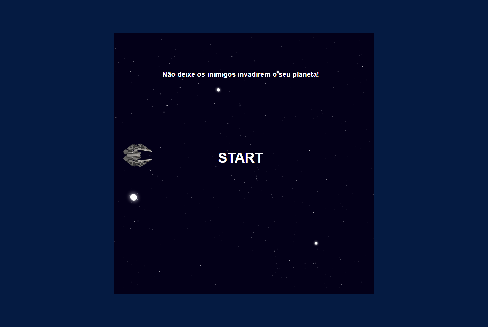

# Projeto Jogo Space Shooter

> Plataforma 

 Projeto realizado no Bootcamp Javascript Game Developer - DIO, foi recriado o jogo estilo space shooter.
 Desenvolvido 22/12/21.

[ 📎 Clique aqui para acessar] (https://michel-maia.github.io/Projeto-Jogo-Space-Shooter/)

 ## Tecnologias 🖥️ 🚀 

- HTML
- CSS
- JavaScript
- Git e GitHub

